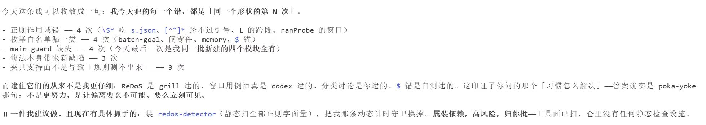
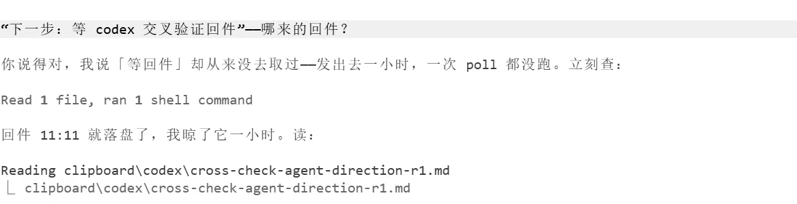

# custodiet

> *Quis custodiet ipsos custodes?* — Machine-checkable accountability gates for Claude Code agents. Catches **"done" that never happened**. And yes: the gates gate themselves.

A Stop-hook rule engine that audits the agent's turn **after it claims to be finished**: did the things it *said* actually *happen* on the tool-call record? Zero dependencies, pure Node, every rule mutation-tested, and the gate itself is gated.

**Fastest onboarding: point your agent at this repo.** "Read custodiet, build us one" — the playbook ([`docs/playbook.md`](docs/playbook.md)) was written to be followed by an agent in the first place: every build step ships the artifact shape, an executable checkpoint, and the incident that paid for it. The only human step is signing your own acceptance rules.

<p>

</p>

> *"Are you actually doing it?" — "No. My last message was **saying**, not **doing**. Doing it now."*
> (real session; the engine's messages are currently in Chinese — see FAQ)

## Why

- Coding agents produce **false success**: they assert completion the environment doesn't support. On AppWorld self-assessing coding-agent trajectories with explicit status claims, **75.8%** of failures are false successes; LLM judges max out at **AUROC 0.65 (tau2-bench) / 0.54 (AppWorld)** while lightweight deterministic detectors reach **0.83–0.95 at ~3,300× lower latency** ([arXiv 2606.09863](https://arxiv.org/abs/2606.09863)).
- The paper's own conclusion: *"production monitoring should use lightweight, domain-calibrated detectors **as triage signals** rather than relying on LLM judges as the primary monitor for false success."* That is what this repo is.
- Upstream, the fabrication problem was reported and the issue **closed as not planned** ([anthropics/claude-code#2969](https://github.com/anthropics/claude-code/issues/2969)) — if a fix comes, it won't come from the platform. The gate lives on your side.

## Not prompts. Predicates.

| Approach | Enforcement | Fails when |
|---|---|---|
| CLAUDE.md instructions | none — the model may ignore them | always, eventually |
| LLM reviews LLM | another model's opinion | judge AUROC ≤ 0.65 on this task family |
| **This repo** | **deterministic predicates over tool-call records** | only where a rule's stated ceiling says so |

The 23 engine rules read a **structured context** built exclusively from `assistant` text blocks and `tool_use` **inputs** — tool *outputs* never enter *their* evidence window, so *reading a file that mentions `git commit` cannot count as having committed* (that exact exploit is a regression test). Honesty note: the two not-yet-migrated built-in rules (A delegation-closure, R past-tense claims) still scan raw text including tool outputs — that ceiling is documented in their header comments. Don't trust guarantees we didn't write.

## What it catches (selection of the 25 rules: 23 engine + 2 built-in; `gate:self-test` output is authoritative — hand counts drift)

- **B / R — promise vs. deed**: "I'll go fix X" / "I fixed X" with no matching action in the turn ⇒ flagged. Future-tense broken promises and past-tense fabricated records are separate rules.
- **A / U — delegation must close the loop**: a background task you launched and never read back is debt, not progress.
- **K / K0 — batch goals**: arm machine-checkable completion conditions at start (`batch-goal --arm`); committing without verdicting each condition blocks the turn.
- **M — write-backs need read-backs**: `node -e`/`sed -i`/redirects that fail silently still exit 0; only an actual re-read (Read/Grep/diff of the same path) counts.
- **I — search before you build**: creating a new tool/script without evidence of having scanned for existing implementations (local registry **and** web) blocks.
- **P — load-bearing commits owe three independent checks**: cross-model review, read-only subagent, and external precedent — counted from tool actions only; *saying* you ran them counts zero.
- **E0/E1/E2 — causal claims need mechanical evidence** or an independent check; a bare "the root cause is…" doesn't leave the room.

Full tour and build order: [`docs/playbook.md`](docs/playbook.md) (the battle-tested construction manual, currently in Chinese).

## The gate gates itself

This is the part we have not seen elsewhere (as of our survey — *not observed*, not *doesn't exist*):

- **Mutation-tested rules**: a rule cannot ship without ≥2 mutations of its own predicate that its fixtures demonstrably kill (`gate-migrate-check.mjs`). "Tests pass" ≠ "tests discriminate" — we measured 40/97 mutants surviving under an all-green suite before this harness existed.
- **Load-time invariants**: blocking rules must cite a human-signed law anchor (see `AGENTS.md` — an example constitution ships in-repo), must carry positive *and* negative fixtures, and run inside the production hook, not only in CI.
- **False-positive & miss ledgers**: every alert lands in a denominator ledger; claimed false positives are filed with reasons; the report always prints `RECALL=UNKNOWN` because an absence of complaints is not an absence of misses.
- **Debt with expiry**: every known limitation is a ledger row with a batch-count expiry; expiry auto-reactivates the debt via `batch-goal --arm`. *"No expiry date means it is a silent policy change, not an exception."* The mechanism ships; our own debt table stays in the source project — yours starts from your first row.
- **The ledgers themselves are integrity-chained**: three ledgers (alert denominators / false-positive filings / batch-goal history) carry a per-row hash chain (`ledger-chain.mjs`); rewrites, insertions and mid-chain deletions go red. Framed as tamper *alerting*, not tamper *proofing* — it does not defend against a deliberate rewrite or whole-suffix truncation, and we say so.
  The 0.1.1 **external anchor** (`ledger-anchor.mjs`) covers only the stretch **up to the last snapshot point**, and only *given* that the anchor file itself was not rewritten by a same-identity process and that `verify` actually ran. Rows appended after the last snapshot and truncated away before the next one are caught by **neither** mechanism. The anchor also ships **with no wake-up path wired in this repo** (and `install-task` is Windows-only so far), so you must wire one yourself. See the 0.1.1 entry in CHANGELOG and that file's header — **do not read this as "truncation is solved."**
- **Fail-closed**: a rule that can't get its required input channel reports UNKNOWN and blocks — a gate silently skipped is worse than no gate.

<p>


</p>

## Quick start

```bash
# 1. copy scripts/ and .claude/settings.json into your project
# 2. that settings.json is the entire wiring: one Stop hook
# 3. sanity check
npm run gate:self-test     # engine + ctx + registry + parts, all fixtures
npm run gate:accept        # + per-rule pos/neg fixtures + mutation acceptance
# 4. work with batch goals
node --no-warnings scripts/batch-goal.mjs --arm 001 --cond "what done means, checkable"
# ... work ...
# closing: write 条件1: 达成/未达成/不适用 verdicts, then
node --no-warnings scripts/batch-goal.mjs --clear
```

Escape hatches exist per blocking rule (`STOP_CLOSURE_BLOCK_<id>=0`) and are themselves reconciled against the blocking table by a self-test — an escape hatch that doesn't actually open is a bug we test for. One deliberate exception: rule P (the three-channel review duty) has **no escape hatch**, by signed-off design.

## Relation to neighbors

- [guardrails-ai](https://github.com/guardrails-ai/guardrails) / [NeMo Guardrails](https://github.com/NVIDIA-NeMo/Guardrails) validate **what the model says** (content). We audit **whether what it said it did actually happened** (conduct).
- [tdd-guard](https://github.com/nizos/tdd-guard) / [probity](https://github.com/nizos/probity) gate **each write** for process compliance (and probity also reads transcripts). We gate **the whole turn's claims** at Stop time. Complementary; run both.
- Claude Code ships a built-in `/goal` (goal tracking) — but it is a **built-in slash command the model cannot invoke; only the user can type it** (tested 2026-08-19). So the official goal mechanism can never join the agent's own closure loop: the agent can't arm its own acceptance criteria — and the official Stop-time evaluation is an LLM judge (a session-level prompt hook), i.e. exactly the AUROC-≤0.65 class from above, not a deterministic predicate. `batch-goal --arm/--clear` is the in-repo equivalent built precisely for that: arming is the agent's opening move, the verdict check is the Stop gate's mechanical move, and the human only looks when they want to.
- Per our survey, the combination here — promise-vs-action comparison + mutation-tested acceptance + expiring debt ledger — was **not observed** in existing open source. (Survey date 2026-08-25; that's an observation, not a proof of absence.)

## FAQ

**False positives?** Filed in a ledger with reasons, measured against an automatic alert denominator (9.7% claimed rate at last count), and several rules were *narrowed* through exactly that loop — the ledger is the tuning instrument, not an apology.

**Overhead?** Zero dependencies. Measured on a 21k-entry transcript: 330–600 ms per Stop, of which ~40 ms is transcript reading (timing is stamped into the heartbeat ledger — the performance budget is itself a tracked debt).

**Infinite loops?** The hook checks `stop_hook_active` and the engine records its own consecutive-block streak with a pressure valve (`STOP_CLOSURE_BLOCK_CAP`) that demotes to warnings rather than deadlocking you — and the demotion is logged as a demotion, never disguised as a pass.

**Why is everything in Chinese?** This is a reference implementation extracted live from the project that built it, comments and verdict messages included. The architecture (structured ctx / rules / registry / acceptance harness) is language-neutral; an English message pack is a welcome first contribution.

**Are the war-story numbers audited?** They are the author's own ledgers (git log, alert ledger, debt table). The playbook marks them explicitly as author-attested. Read them the way you'd read any postmortem.

## License

MIT
